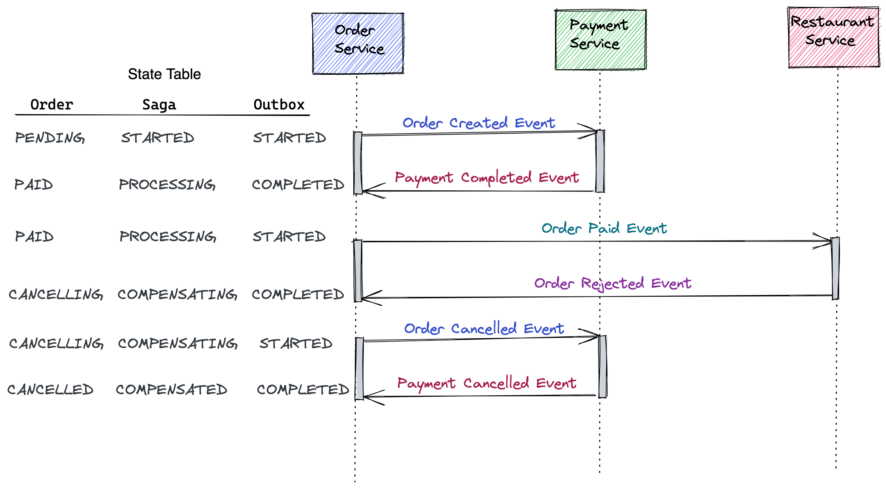

# Food Ordering System

Its a multi-module maven project

### Project Structure

## Common

### Common Domain

This module consists of root level entities and other entities that are common for all the modules in the project. It
has the following packages

1. Entity
2. Event
3. Exception
4. ValueObject

ValueObjects are wrapper objects that are used for representing the field values in the system.

> Eg: Money = ValueObject wrapper for BigDecimal

The entities in this module will be extended by the other modules and provides implementation.

### Common Application

This module is responsible for holding global exception classes and DTO models related to application services.

## Order Service

This Service is responsible for everything related to the order.

### Order Domain Core

This module is contains all the Domain objects related to the Order Service. It consists of

- Domain Entities and Validation logic for the entities
- Event Objects that will be passed for communication
- Custom Domain Exceptions
- Value Objects (Money, CustomerId)

[OrderDomainServiceImpl](order-service/order-domain/order-domain-core/src/main/java/org/sarav/food/order/service/domain/OrderDomainServiceImpl.java)
This is the implementation class for validating the values in order related entities. During Order Creation, it also
initiates the order domain object with OrderId and TrackingId and creates an OrderCreatedEvent.

### Order Application Service

This module consists of the following for order service.

- config data for order service
- dto objects for command and query objects that will be sent from the client, which will be converted to domain objects
  and also DTO for message objects.
- mapper class that is responsible for converting dto to domain objects
- Ports of 2 types Input Port will be message listeners of kafka topics and the request from the client. Output Ports
  for the order service is message publishers of kafka topics and the repository that will handle the persistence

[OrderApplicationServiceImpl](order-service/order-domain/order-application-service/src/main/java/org/sarav/food/order/service/app/ports/OrderApplicationServiceImpl.java)
This class serves as the wrapper for handlers that will handle the command and queries from the Controller layer(REST).

## Order Data Access

This module serves as the persistence layer for order service Each module consists of 4 packages.

- entity
- mapper
- adapter
- repository

Entity package consists of Objects that will be used by the persistence layer.

Mapper is used for converting entity objects to domain objects and vice-versa.

Repository is consists of JpaRepository interface extensions provided by spring-data-jpa

**Adapter is the class that plugs-in to the output port (Order Repository) of the Domain's application service**

### Order Messaging

This module is responsible for publishing and receiving messages to kafka for events in order-service.

### Order Application

This module serves as the Controller layer of the application.

### Order Container

These modules have dependency for all the maven modules and acts as a wrapper for all the modules. It's the root for
spring boot application of Order Microservice.

### Order Creation Flow

HTTP Client -> OrderController -> OrderApplicationServiceImpl -> OrderDomainService(for validation) -> OrderPersistence

After Persistence, OrderDomainService returns OrderCreatedEvent -> CreateOrderKafkaMessagePublisher -> Returns Response
to user

SAGA Implementation

#### Happy Flow:

1) Customer Places the Order. Order status will be initialized to `PENDING`.
2) PaymentRequest will be sent to PaymentService.(
   Entrypoint: [PaymentRequestKafkaListener.java](payment-service/payment-messaging/src/main/java/org/sarav/food/payment/service/messaging/listener/kafka/PaymentRequestKafkaListener.java))
3) PaymentCompleted response will be sent back to OrderService
4) Order status will be updated to `PAID`.
5) RestaurantApproval will be sent to RestaurantService(
   Entrypoint: [RestaurantApprovalRequestKafkaListener.java](restaurant-service/restaurant-messaging/src/main/java/org/sarav/food/restaurant/service/messaging/listener/kafka/RestaurantApprovalRequestKafkaListener.java))
6) RestaurantService will send back OrderApproved response to OrderService
7) Order Status will be updated to `APPROVED`.

#### Order could get cancelled if

1) any order items are not available in the restaurant.
2) Right now it throws OrderDomainException if Product id is invalid.

## Saga with Outbox Pattern

To make this long-running transaction of Order System more robust, we make use of Saga and Outbox Pattern. Order Service
is going to be the Saga Orchestration Service.

It has 2 outbox tables namely OrderApproval Outbox Table and PaymentOutbox Table.

A customer places the order. Instead of order-service directly pushing a message to the bus, event will be persisted in
the PaymentOutboxTable as PaymentOutboxMessage.

Then it will be read by a scheduler, and it is responsible for sending this messages to the event bus(Kafka).

#### Saga with Outbox Happy flow

#### Saga with Outbox When Payment failed

#### Saga with Outbox When Order Rejected

### TODO: Need to handle credit entry and customer balances.

